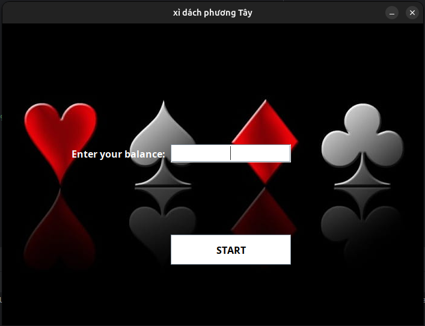

<h1 align="center">Blackjack</h1>
<p align="center">
  A single player Java desktop game built with object-oriented programming.
</p>
<p align="center">
  
  
  
  
</p>
<p align="center">
  <a href="#overview">Overview</a> ·
  <a href="#quick-start">Quick Start</a> ·
  <a href="#how-to-play">How to Play</a> ·
  <a href="#architecture">Architecture</a> ·
  <a href="#known-issues">Known Issues</a>
</p>

---

<p align="center"><sub>Game table screenshot included in the repository. See known issues for current source limitations.</sub></p>

---

# Overview
Play against a computer controlled dealer, place a bet, and build a hand close to 21. Developed for the Object-Oriented Programming course at International University, VNU-HCM, this project demonstrates Java classes, composition, inheritance, and event driven desktop interfaces.
> **Game variant:** This implementation uses custom Xì Dách rules, including a minimum standing total of 15 and a five card condition.

---

# Features
| | Feature | Implementation |
|:---:|---|---|
| 🃏 | Card system | Shuffled 52-card deck and adjustable Ace values |
| 🎮 | Player controls | Hit, Stand, and Exit buttons |
| 🟠 | Betting | 1, 5, 10, 25, 100, or All In |
| 📊 | Session tracking | Balance and player/dealer win counters |
| 🔊 | Audio | Background audio and action sound effects |
| 🖥️ | Desktop interface | Balance entry, main menu, Help, and About Us |

---

# Quick Start
## 1. Prepare your environment
- Install a JDK with `java` and `javac` available in your terminal.
- Use a desktop environment with audio support.
- Download or clone the repository and keep its image and sound folders intact.
The source uses Java 8 language features and standard library APIs. No external Java dependencies or database are required.
From the repository root:
```sh
cd blackjack_project
java -version
javac -version
```

## 2. Fix the card image path
In `src/Card.java`, replace the missing image reference:
```sh
// Before
BufferedImage backOfACard = ImageIO.read(new File("images/backsideOfACard.jpg"));

// After
BufferedImage backOfACard = ImageIO.read(new File("images/backside_card.png"));
```
The original filename is absent from the repository and can prevent card rendering. This is a required manual correction to the supplied source.

## 3. Compile and launch
```sh
mkdir out
javac -encoding UTF-8 -d out src/*.java
java -cp out Tester
```
Skip `mkdir out` if the folder already exists. Run from main so relative asset paths resolve correctly.
<details>
<summary><strong>Using Visual Studio Code</strong></summary>
1. Open `blackjack_project` as the workspace folder.
2. Open the integrated terminal.
3. Run the compile and launch commands above.
4. If using an IDE launch configuration, use `Tester` as the main class and `blackjack_project` as the working directory.
</details>
<details>
<summary><strong>Troubleshooting</strong></summary>
| Symptom | Check |
|---|---|
| `javac` is not recognized | Install a JDK and check its `bin` directory is on your terminal path. |
| Images are missing | Launch from `blackjack_project` and apply the card image correction above. |
| Balance entry throws an error | Enter a positive whole number, such as `1000`. |
| Audio throws an error | Check that the sound files exist and an audio device is available; audio error handling needs improvement. |
**Validation:** Documentation was checked against the supplied source and asset paths. Compilation and interactive gameplay were not verified in the review environment because `javac` was unavailable.
</details>

---

# How to Play
| Step | Action |
|---|---|
| 1 | Enter a starting balance and click START. |
| 2 |	Select PLAY from the menu. |
| 3 |	Click the betting chip and choose a bet within your balance. |
| 4 |	Select HIT to draw or STAND when your total is at least 15. |
| 5 |	Play another round or select EXIT. |
<details>
<summary><strong>Card values and game rules</strong></summary>
| Rule | Current implementation |
|---|---|
| Number cards | Face value |
| J, Q, K | 10 points |
| Ace | 11 or 1, adjusted when needed |
| Initial deal | Two cards each; dealer cards initially hidden |
| Player standing | Allowed at 15 or higher |
| Dealer drawing | Draws at 14 or lower |
| Opening Blackjack | Checks for an initial total of 21 |
| Five cards condition | Checks for five cards totaling 21 or less; see edge-case issue below |
| Tie | Equal totals or both hands over 21 in the Stand handler |
| Balance settlement | One bet gained/lost; unchanged on a tie; no special 3:2 payout |
Balances and scores last for the current session only. The opening screen collects a balance and does not provide account authentication.
</details>
<details>
<summary><strong>Screenshot: starting-balance screen</strong></summary>

</details>

---

# Architecture
| Class | Responsibility |
|---|---|
| `Tester` | Entry point, windows, session state, and background threads |
| `Card` | Card properties and sprite rendering |
| `Deck` | Deck creation, shuffling, and card removal |
| `Game` | Dealing, player actions, hand evaluation, and round outcomes |
| `GameComponent` | Table rendering, balance display, and bet input |
| `OptionsComponent` | Menu rendering and menu interactions |
| `SE` | Audio loading and playback |
<details>
<summary><strong>Object-oriented concepts demonstrated</strong></summary>
| Concept | Example |
|---|---|
| Encapsulation | Private card fields with getters; private deck collection |
| Composition | A deck contains cards; a game manages a deck and two hands |
| Inheritance | UI components extend `JComponent` |
| Interfaces | UI components implement `MouseListener` |
| Overriding | Custom painting, mouse handlers, and thread `run()` methods |
| Singleton-style access | `Tester.getInstance()` returns a shared instance |
Several classes share static state. Further separation of game logic from the UI would improve testability.
</details>

---

# Project Files
| Path | Contents |
|---|---|
| `src/` | Seven Java source files |
| `images/` | Card graphics, interface assets, and screenshots |
| `sounds/` | Music and sound effects |

---

# Known Issues
**Educational prototype:** apply the image path correction before running. Gameplay edge cases and UI threading also need improvement.
<details>
<summary><strong>View source-review findings</strong></summary>
| Area | Finding |
|---|---|
| Assets | `Card.java` references a missing card-back filename. |
| Balance input | Invalid integers can throw an exception; zero and negative values are not rejected at entry. |
| Betting | Canceling can start a zero-value round; repeated chip clicks are not guarded during a round. |
| Five-card result | Exactly five cards totaling 21 satisfy both player win and loss checks. |
| Opening Blackjack | Sequential checks can produce conflicting outcomes when both hands have Blackjack. |
| Bust handling | Hit does not consistently end the round immediately after a bust. |
| Help text | Some instructions mention 14, but standing requires at least 15. |
| UI threads | Continuous loops lack a delay; some Swing changes run outside the Event Dispatch Thread. |
| Resources | Images reload during painting; audio initialization failures can leave a null clip. |
| Tests | No automated test suite or build-tool configuration is included. |
</details>

---

# Roadmap
- [ ] Correct asset references and round-ending edge cases.
- [ ] Validate balances and bets; enforce one active round.
- [ ] Separate game rules from Swing components.
- [ ] Replace busy loops with event-driven updates.
- [ ] Add scoring and round-resolution tests.

---

# Team
| Contributor | Student ID |
|---|---|
| Nguyen Hieu Nguyen | ITDS******* |
| Xuan Tam Le | ITDS******* |
| Ngoc Sang Nguyen | ITDS******* |
Contributing
Open an issue or submit a focused pull request. Include reproduction steps, Java version, operating system, and how you checked your change.
License
The supplied repository has no `LICENSE` file, although its original README mentioned MIT. Maintainers should confirm the license and document image and audio permissions.

---

<p align="center"><a href="#blackjack">Back to top ↑</a></p>
